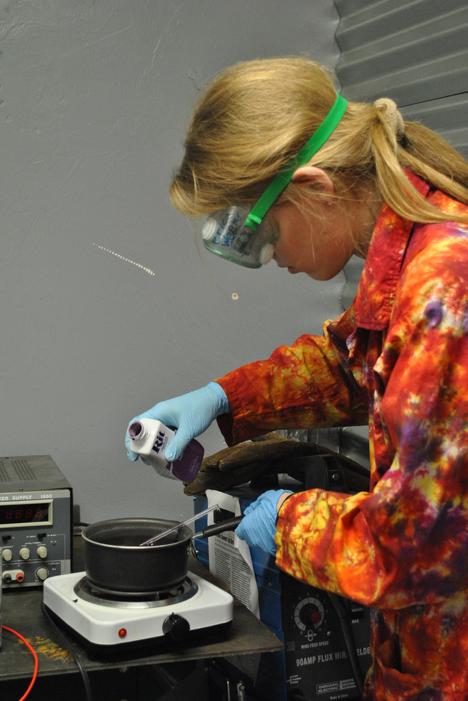
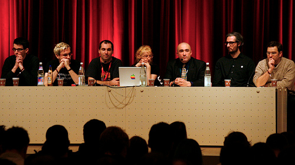
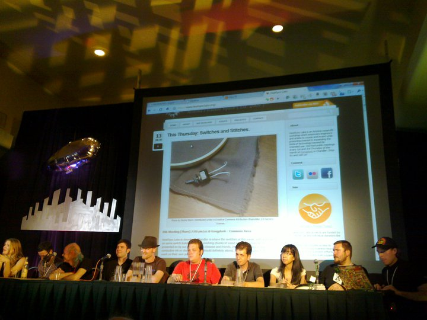
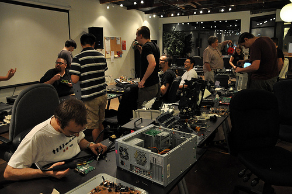

# About

**Page** · 2009-07-26 · by `admin` · 1 comments · `wp_posts.ID=2`

---

*6626377951_8c74520d61_b*
Jasper Nance demonstrates anodizing aluminum. Photo by HeatSync Labs. Distributed under a CC-BY-SA license.

### Philosophy

Established in 2009, HeatSync Labs is Arizona's first 501(c)3 [hackerspace](http://en.wikipedia.org/wiki/Hackerspace). We are a community workshop that makes workspace, tools, and other resources available to students and hobbyists, artists, engineers and entrepreneurs to build their projects, prototypes, and art. We believe in creating a community of collaboration and learning-by-doing.

### History

The concept for HeatSync Labs came out of the desire for a group of Arizona locals to get together and continue working on projects after academic life. Instead of working alone, we wanted to build our workshops in public. Throughout 2009, we discovered, and in some cases, visited, other notable 'hackerspaces' popping up across the country ([NoiseBridge](http://www.noisebridge.net), [Pumping Station: One](http://pumpingstationone.org/), [NYC Resistor](http://www.nycresistor.com/), [Hacklab Toronto](http://hacklab.to/), and [HacDC](http://hacdc.org/)) and wondered what was holding us back.  We decided to join in on making a place where you can make things without needing your own workshop, alongside other creators.

We started our meetings in 2009 at the Mesa Fraternal Order of Police lodge, sans wifi or permanent space, then moving to Chandler's Gangplank in January 2010, and as of June 2011 began renting our own facility in Downtown Mesa. What started out as a few excited people in a police lodge meeting biweekly is now a community of hundreds, with over seventy paying members occupying our location nearly 24/7.

### Connect

If you’re in the Phoenix valley area and are interested in the hackerspace idea, join in on the discussion on [these fine outlets](/get-involved) of the Information Super Highway.

### Press

Please see our [press page](http://wiki.heatsynclabs.org/wiki/Press_Kit) in order to properly reference us.

---

### Attached media

---

[← archive index](../README.md)
