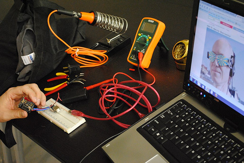

# Projects

**Page** · 2009-07-28 · by `admin` · `wp_posts.ID=53`

---

[!\[Projects to push humanity forwards.\](../images/uploads/2009/07/5755588028_7b792f1844.jpg)](http://www.flickr.com/photos/sparkfun/5755588028/in/photostream/)
*Photo by Sparkfun Electronics. Distributed under a Creative Commons Attribution 2.0 Generic (CC BY 2.0) license.*

HeatSync Labs brings people and resources together to build awesome things, from 3D printers to near-space dirigibles. **Check out our [Projects wiki page](http://www.heatsynclabs.org/wiki/Projects)** for the latest and greatest projects in the works, or if that doesn't satisfy you take a gander at the [Google Discussion Group](http://groups.google.com/group/heatsynclabs).

---

### Attached media

---

[← archive index](../README.md)
