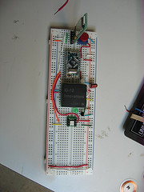
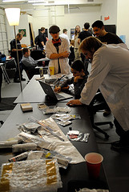

# This Week: Two Meetings for the Price of One!

**Post** · 2010-02-01 · by `huertanix` · 1 comments · `wp_posts.ID=342`

---

[!\[\](../images/uploads/2010/02/skyler_reprap_board.jpg)](http://www.flickr.com/photos/25968780@N03/4323233215/in/pool-1298721@N24)
*Photo by .dh. Distributed under a Creative Commons Attribution-Non-Commercial 2.0 Generic License.*

This is the month we move back to our original meeting schedule--the first and third Thursday of the month, that is! Same bat time, same bat place. That means that Arduino night, which takes place on the first Wednesday of the month, and the next HeatSync Labs meeting, which takes place on the first Thursday of the month, will be back-to-back this week, like peanut butter and jelly nutella and bananas.  Can't decide which one?  (PROTIP: Do both).  Here's the scoop on each:

**Arduino Night (Wed) 7:00 pm|az @ Gangplank - Conference Room
**

If you have any interest in learning about the hottest thing to come from Italy since [Monica Belluci](http://www.flickr.com/photos/25968780@N03/4323962850/), check out Arduino night.  Whether you're just getting your feet wet in microcontrollers or are a closeted PIC controller programmer, you'll have the company of a wide skill range of Arduino hackers to collaborate with, as well as some HSL laptops with the Arduino software preloaded.

**HSL Meeting (Thurs) 7:00 pm|az @ Gangplank - Commons Area
**

We're working full speed ahead on our RepRap printer.  At this point, over 50% of our plastic parts have been printed, thanks to Jeremy, Karl, Rene, and more.  At our previous meeting, we wrapped up a lot of dip soldering, reflow soldering, and got more than half of the cables made.  This week we'll be testing and programming circuit boards, building the extruder, and wrapping up most of the wiring.  As always, you're welcome to bring in your own project and work on it with us too.

At both events, we'll have t-shirts for sale and subscription forms for Make magazine available if you prefer not to do it online.  You can also give us cash if you'd like!

---

### Attached media

---

[← archive index](../README.md)
