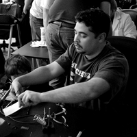

# Board

**Page** · 2010-02-06 · by `huertanix` · 1 comments · `wp_posts.ID=360`

---

HeatSync Labs is ultimately led by a Board of Directors.  Each officer is voted into office once a year by the membership, unless they become vampires or become impeached.  The [bylaws](http://www.heatsynclabs.org/wiki/Bylaws) outline the structure of the Board in more detail.

**Please direct most questions to our community by emailing the [Google Group](http://groups.google.com/group/heatsynclabs)** -- we are a grassroots organization and all but the most critical of decisions are made by the community. If you absolutely must get in contact with the entire board, however, you may email board [at] heatsynclabs.org. Don't be surprised if we ask you to contact the Google Group; the board doesn't decide most things, the community does.

Our current slate of officers are the following:

### **Champions**

**Jeremy Leung**
jeremy [at] heatsynclabs.org

Originally from Deutschland, Jeremy immediately fell in love with the American hacker community and is driven to promote the positive connotations of the word "hacker".  After graduating from UAT and stepping down from leadership of DC480, to join the work force, he still had the lingering idea of wanting to make a mad scientists lab with his friends.  During the day he works as a systems and network security engineer.  At night he dons the appropriate safety gear to create things and push HeatSync Labs forward.

**Tim Gerrits**
tim [at] heatsynclabs.org

Tim traces his prolific lineage to the Dutch Kingdom of the Northeast Midwest, born of simple travelers whose livelihoods subsisted of crafting remote control automata and airborne Italian food.

 

 

.

### **Treasurers**

**Chad Stearns**
chad [at] heatsynclabs.org

Chad is a thoughtful man, highly recommended by all who ever have or will come into his presence. Some claim he is a genius, others say he's a savant. All we know is, he is Chad.

 

 

 

 

**Marita Ogden**
marita [at] heatsynclabs.org

Multidisciplinary and polyphasic, Marita is known to occupy multiple valence shells simultaneously. Her contributions and dedication to the organization are incalculable, as it is impossible to measure both quantum states simultaneously.

 

 

### **Secretary**

 **Paul Hickey**
paul [at] heatsynclabs.org

Graciously taking the reins from former Secretary Rix, Paul brings an air of respectability and much-improved facial hair to the Board. Known not only for his prowess with a rapier, but with a video camera, Mr. Hickey wields Robert's Rules of Order with a leather-bound fist.

 

 

### **Operations**

**Will Bradley**
will [at] heatsynclabs.org

Hailing from the exotic Kingdom of Hawaii, Will is an IT Manager, Freelance Developer, and security pro with an interest in electronics and practicality.  He's lost count of how many servers under his dominion, and can be seen playing with SQL injection, lockpicking, ARP spoofing, and WEP cracking, as well as exploring electronics, microcontrollers, and Ruby on Rails. Hobbies include video production, photography, gaming, snowboarding, and being an Internet Tough Guy.

---

### Attached media

---

[← archive index](../README.md)
