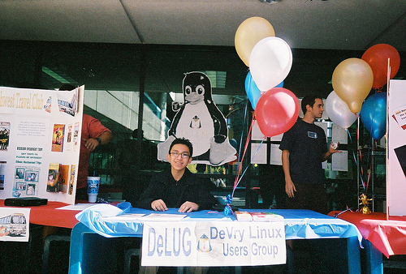

# Benefits of HeatSync Labs Membership: Now with storage!

**Post** · 2010-09-21 · by `huertanix` · `wp_posts.ID=945`

---

[!\[\](../images/uploads/2010/09/4952958609_dc461dc61a.jpg)](http://www.heatsynclabs.org/wp-content/uploads/2010/09/4952958609_dc461dc61a.jpg)
*Photo by JohnKit. Distributed under a Creative Commons Attribution-NonCommercial-NoDerivs 2.0 Generic License.*

HeatSync Labs started out as a small gathering of hackers and tinkerers from across the Phoenix valley area in empty UAT rooms and scary alleyways in Mesa. Through much effort, outreach, and fundraising, we have become a premier hackerspace that has not only made itself an internationally-recognizable name among other hackerspaces, but has brought together people and resources that would never have otherwise.  Our momentum continues, and you can help us grow better, faster, and stronger by [becoming a member](http://www.heatsynclabs.org/get-involved/membership/) today!

*But wait, there's more!*

One of our goals in establishing a hackerspace was the ability to access it 24/7.  We can now offer that to our paying members, among other goodies at two tiers:

**Basic Membership**: For $50 a month, you get:

- **24/7** access to HeatSync Labs (located inside Gangplank) including a key and security code.

- Access to shared HeatSync tools and equipment

- Personal project space for a banker box (first one being provided by HeatSync Labs).

**Plus Membership**: For $75 a month, you would receive all the benefits of basic membership, as well as...

- A **locker** in the lab (lock not included)!

[Become a member today](http://www.heatsynclabs.org/get-involved/membership/)!

---

### Attached media

---

[← archive index](../README.md)
