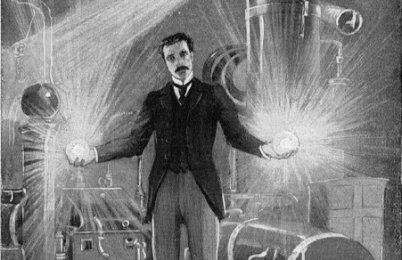

# (Oct 23) Mustaches, Music, and Mad Science!

**Post** · 2010-10-11 · by `huertanix` · 2 comments · `wp_posts.ID=994`

---

*Drawing by some dude too dead to sue anyone. Distributed under the public domain.*

**Mustaches, Music, and Mad Science! (Sat, Oct 23rd) 8:00 pm|az @ Gangplank**

The rumors are true, Arizona's first hackerspace turns one year old this month, and to celebrate all the awesomeness we squeezed into 2010, we're throwing the most insane party Chandler has yet seen!  Our main course for the night will include musical performances of the experimental electronica variety, courtesy of [Thru the Wires](http://www.myspace.com/thruthewires). Specifically:

- Terminal 11

- Menegam

- Dim

- +Peloton Musique DJs

Attendees are encouraged to either have or wear a mustache to the event.  Don't have facial hair but have some cash?  No problem!  Bring some dough to have a custom 3D-printed mustache made for you.  On the subject of dough, OvenTree Bakery will be providing freaking donuts, for free, because we're punk like that.

*But wait, there's more!*

It wouldn't be a HeatSync Labs party without voltages reaching the triple digit range.  That's why we're bringing in member projects to showcase at the event, including a Tesla coil and things that involve several yards of EL wire and high-powered lasers.  Some featured projects in the showcase will include:

- [5' Tesla Coil](http://en.wikipedia.org/wiki/Tesla_coil)

- [RepRap 3D Printer](http://reprap.org/wiki/Main_Page)

- [Van de Graaff Generator](http://en.wikipedia.org/wiki/Van_de_Graaff_generator)

- [Motoduino](http://www.heatsynclabs.org/arduino-motorcycle-motoduino/)

- [Solar Recumbent Trike](http://solartrike.freehostingcloud.com/)

- UV Light Graffiti Wall

- EL Wire Display

**Suggested donation cover is $10**, although if you want to establish that you are indeed a major baller, feel free to donate more.  In addition, if you want to establish that you are serious business, feel free to wear something mad scientisty or whatever glowing latex outfit you only wear at Defcon.

Feel free to RSVP on [Facebook](http://www.facebook.com/#!/event.php?eid=109314745794645) or [Eventification](http://evnt.us/e9r) to help us get a head count.  See you on the 23rd!

*Established in 2009, HeatSync Labs is Arizona's first *[hackerspace](http://en.wikipedia.org/wiki/Hackerspace)*. Its Chandler-based lab provides workspace, tools, equipment, and other resources while creating a community of collaboration and learning-by-doing.*

---

[← archive index](../README.md)
