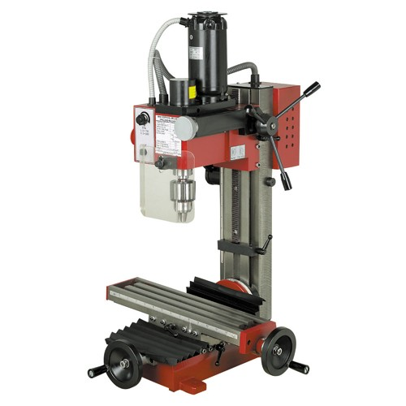
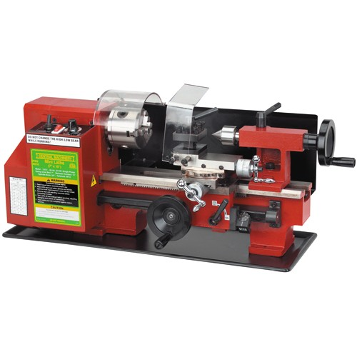
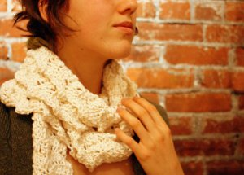

# Classes & Workshops

**Page** · 2011-02-16 · by `will` · `wp_posts.ID=1337`

---

[Back to Store](/store)

### [Offsite image — hosted on guestlistapp.com · open →](http://guestlistapp.com/manage/events/64677/logo/1311623958/logo.jpg)Sock Babies Beginners Workshop: Learn How To Make Your Very Own Sock Doll (Saturday, September 10)

#### Event Information

Every sock doll is unique, especially when it is made by hand and from your heart.  You will be learning about the different tools and materials, how to choose the right socks, and the seven types of stitches you need to know to bring your creation to life.  You will be making your first sock doll, step-by-step, with your instructor - and when the class is over, you will have a new friend to bring home!

Materials supplied in class:

- Socks

- Stuffing

- Threads

- Doll needles

- Sewing snips

- Buttons and beads

Tools to bring:

- Fabric scissors (or a very sharp pair of regular scissors that can cut through fabric - there will be a couple of fabric scissors available for use in class, but not enough for everybody)

- Color pencil, erasable pen, or disappearing ink pen for marking on fabric (suggested, but not necessary)

- Tweezers

As we are working with needles and sharp scissors, this class will have an age limit of at least 12 years of age.

**Instructor:
**
**Charlotte Lye**

**RSVP required, register now ($20 non-member, $17.50 member):** [http://guestlistapp.com/events/64677](http://guestlistapp.com/events/64677)

---

### Attached media

---

[← archive index](../README.md)
