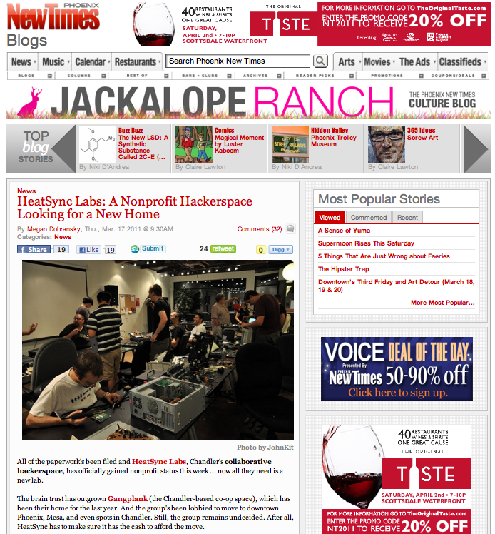
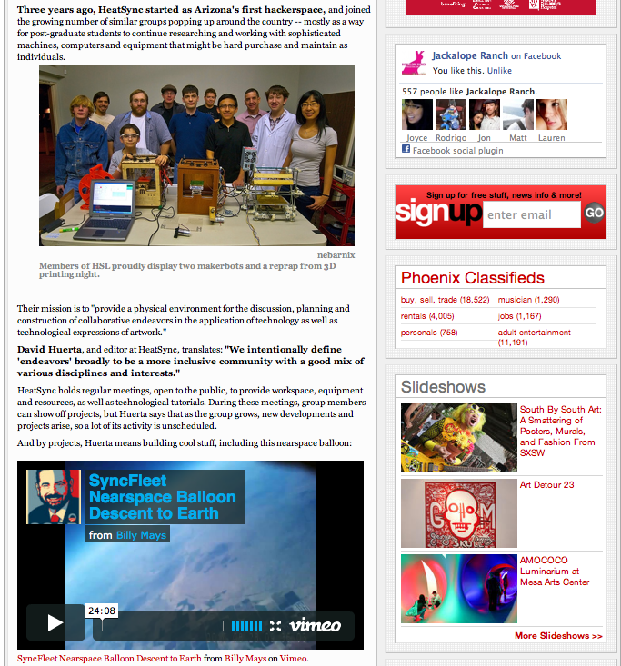
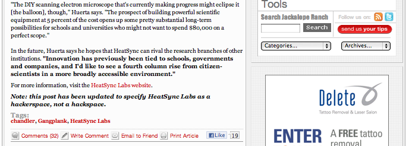
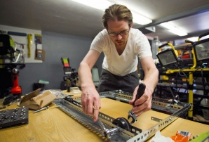

# Press

**Page** · 2011-02-21 · by `will` · `wp_posts.ID=1391`

---

HeatSync Labs is getting the attention of both mainstream media and hacker/maker communities worldwide. Here are some snippets:

**Gallery — Press**

[!\[screen-shot-2011-02-21-at-2-52-32-am\](../images/gallery/press/screen-shot-2011-02-21-at-2-52-32-am.png)](../images/gallery/press/screen-shot-2011-02-21-at-2-52-32-am.png)
*screen-shot-2011-02-21-at-2-52-32-am*

[!\[screen-shot-2011-02-21-at-2-53-14-am\](../images/gallery/press/screen-shot-2011-02-21-at-2-53-14-am.png)](../images/gallery/press/screen-shot-2011-02-21-at-2-53-14-am.png)
*screen-shot-2011-02-21-at-2-53-14-am*

[!\[screen-shot-2011-02-21-at-2-53-59-am\](../images/gallery/press/screen-shot-2011-02-21-at-2-53-59-am.png)](../images/gallery/press/screen-shot-2011-02-21-at-2-53-59-am.png)
*screen-shot-2011-02-21-at-2-53-59-am*

[!\[screen-shot-2011-02-21-at-2-54-16-am\](../images/gallery/press/screen-shot-2011-02-21-at-2-54-16-am.png)](../images/gallery/press/screen-shot-2011-02-21-at-2-54-16-am.png)
*screen-shot-2011-02-21-at-2-54-16-am*

[!\[screen-shot-2011-02-21-at-2-54-55-am\](../images/gallery/press/screen-shot-2011-02-21-at-2-54-55-am.png)](../images/gallery/press/screen-shot-2011-02-21-at-2-54-55-am.png)
*screen-shot-2011-02-21-at-2-54-55-am*

[!\[screen-shot-2011-02-21-at-2-55-14-am\](../images/gallery/press/screen-shot-2011-02-21-at-2-55-14-am.png)](../images/gallery/press/screen-shot-2011-02-21-at-2-55-14-am.png)
*screen-shot-2011-02-21-at-2-55-14-am*

[!\[screen-shot-2011-02-21-at-2-55-34-am\](../images/gallery/press/screen-shot-2011-02-21-at-2-55-34-am.png)](../images/gallery/press/screen-shot-2011-02-21-at-2-55-34-am.png)
*screen-shot-2011-02-21-at-2-55-34-am*

[!\[screen-shot-2011-02-21-at-2-56-35-am\](../images/gallery/press/screen-shot-2011-02-21-at-2-56-35-am.png)](../images/gallery/press/screen-shot-2011-02-21-at-2-56-35-am.png)
*screen-shot-2011-02-21-at-2-56-35-am*

[!\[screen-shot-2011-02-21-at-2-56-57-am\](../images/gallery/press/screen-shot-2011-02-21-at-2-56-57-am.png)](../images/gallery/press/screen-shot-2011-02-21-at-2-56-57-am.png)
*screen-shot-2011-02-21-at-2-56-57-am*

[!\[screen-shot-2011-02-21-at-2-57-12-am\](../images/gallery/press/screen-shot-2011-02-21-at-2-57-12-am.png)](../images/gallery/press/screen-shot-2011-02-21-at-2-57-12-am.png)
*screen-shot-2011-02-21-at-2-57-12-am*

[!\[screen-shot-2011-02-21-at-2-57-38-am\](../images/gallery/press/screen-shot-2011-02-21-at-2-57-38-am.png)](../images/gallery/press/screen-shot-2011-02-21-at-2-57-38-am.png)
*screen-shot-2011-02-21-at-2-57-38-am*

[!\[\](../images/uploads/2011/02/PHP4FAF621726EFD-150x150.jpg)](http://www.heatsynclabs.org/wp-content/uploads/2011/02/PHP4FAF621726EFD.jpg)
*Michael Schennum/The Arizona Republic*

"What made me feel comfortable taking on this project is the community of HeatSync."
[Stray Cat's 'Heddatron' star kidnapped by robots](http://www.azcentral.com/thingstodo/stage/20120507stray-cat-theatre-heddatron-tempe-robots-heatsync#ixzz1xArpsKSw) by Kerry Lengel - May. 12, 2012 , The Arizona Republic | azcentral.com

"As of this writing, the 'HeatSync Labs Location Search Committee' had 100 votes in favor of is proposal to move to downtown Mesa."
*["Is Mesa the perfect new home for HeatSync Labs,"](http://blogs.evtrib.com/nerdvana/2011/02/04/heatsync/) Jayson Peters, [Nerdvana: Sci-fi, Comics, Games & More,](http://blogs.evtrib.com/nerdvana/) East Valley Tribune, 4 February 2011*

"HeatSync Labs is the kind of place that births entrepreneurs and innovators. These guys create buzz, energy, and would add a brand new dimension to downtown Phoenix. These kinds of people do things and affect change in ways that don’t always fit Corporate America’s myopic ROI requirements. These are the people we need downtown."
*["Fighting to win HeatSync Labs, "](http://phxdowntowner.org/2011/02/14/heatsync-labs/) [PhxDowntowner](http://phxdowntowner.org/), 14 February 2011*

"These guys are definitely aware of the social and political aspects of what they're doing. They view themselves as citizen-scientists [...] they want to both improve themselves and generate useful knowledge that the standard scientific research process won't touch."

"They also are very forward about getting their work out there and connecting with like minded hackers across the world. [...] In the next few months and years, I hope to spend a fair amount of time with Augmented Humanity, develop some projects, and get them out there. But for now, rest easy knowing that these people have the future well in hand."
*["Augmenting Humanity @HeatSync Labs](http://www.cspo.org/soapbox/view/110208P2NI/augmenting-humanity-heatsync-labs/)," Michael Biff Burnam-Fink, [ASU Consortium for Science, Policy, & Outcomes](http://www.cspo.org/), 8 February 2011*

‎"We need innovators, entrepreneurs, young blood -stuff we don't have a lot of here right now."
*["Innovation lab looks at moving to Phoenix, downtown promoted as a possibility,"](http://downtowndevil.com/2011/02/17/heatsync-innovation-lab-downtown-phoenix/) Victoria Pelham, [Downtown Devil](http://downtowndevil.com/), 17 February 2011*

"Three years ago, HeatSync started as Arizona's first hackerspace, and joined the growing number of similar groups popping up around the country -- mostly as a way for post-graduate students to continue researching and working with sophisticated machines, computers and equipment that might be hard purchase and maintain as individuals."

*["HeatSync Labs: A Nonprofit Hackerspace Looking for a New Home,"](http://blogs.phoenixnewtimes.com/jackalope/2011/03/heatsync_labs_gains_nonprofit.php) Meghan Dobransky, [Jackalope Ranch](http://blogs.phoenixnewtimes.com/jackalope/), [Phoenix New Times](http://www.phoenixnewtimes.com/), 17 March 2011*

---

### Attached media

---

[← archive index](../README.md)
