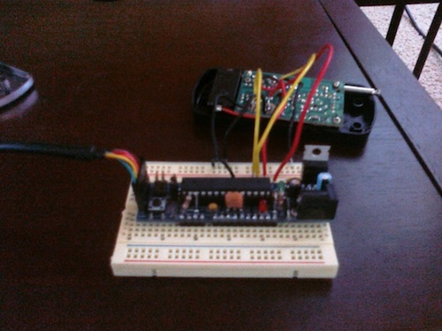
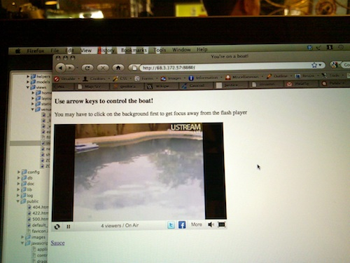

# Boatduinode: A Pool Party with Arduino, Node.js, and an RC Boat!

**Post** · 2011-03-02 · by `huertanix` · 2 comments · `wp_posts.ID=1458`

---

***Editor's Note****: As part of my position as Editor at HeatSync Labs, I get to put on a reporter hat and take the spotlight of the Information Super Highway on our local Arizona makers, hackers, and tinkerers. If you or anyone you know is building something pretty awesome and they're within driving distance, leave a comment and I'll see if I can follow up on it. This $timeFrame's features maker is Andrew "Tuna" Harris, who created a Node.js and Arduino-powered interface to control his RC boat from cybersauce.*

*[!\[I\](../images/uploads/2011/03/boatduinode_cartel_500px1.jpg)](http://www.flickr.com/photos/25968780@N03/5492638601/in/photostream/)*
*Photo by .dh. Distributed under a Creative Commons Attribution 2.0 Generic (CC BY 2.0) License.*

[Node.js](http://nodejs.org/) has been getting more buzz than a barber shop full of UNIX sysadmins.  Its used for a wide variety of cool things like baiting SEO, but did you know it can send messages through websockets?  It can!  Every now and then it'll chat up Ruby client who will chat up an Arduino board and ask it to move an RC boat around in suburban Avondale.  This is exactly what Boatduinode does.

After being bored by his non-web controlled RC boat, Tuna decided to let the internet take the wheel and build something to make it happen or die trying.  The [boat itself](http://www.dunnriteproducts.com/skimmers.htm)was a skimmer with a net attached, adding the bonus of having the internet clean his pool for him.  Some research was done on interfacing with radio controlled systems and simulating buttons presses, as well as some ideas from similar RC projects.  Since the original RC remote control was off-limits, a similar remote control for an RC car turned was used, as it turned out to use the same frequency.  A Boarduino was used so that the remote could be wired into an Arduino serial interface, and from there connected to a laptop running Ubuntu.  No specialized shields or components needed.

*Photo by Andrew Harris. Distributed under the public domain.*

The laptop runs node.js with socket.io, utilizing the ability to send messages through websockets without having to create an infrastructure for sending and receiving traditional requests through web services.  With this, Tuna also found a good excuse to experiment with node.js and socket.io, which he'd previously never touched.  Some Ruby scripting handles some of command signaling from the node.js server (using a readily available Ruby websocket library), and the commands are passed in and interpreted by the Boarduino and sent to the frankensteined RC remote.

The boat can be controlled from the Information Super Highway using a simple web page which listens for arrow key presses and displays a Ustream feed to show off the boat in action.  The site itself isn't online at the moment, but some footage was recorded:
**Video** [watch on Vimeo →](https://vimeo.com/20150885)

[Boatduinode](http://vimeo.com/20150885) from [Tuna](http://vimeo.com/supertunaman) on [Vimeo](http://vimeo.com).

According to Tuna, the number of people that took the wheel on his boat was around 15, including a stoner in Canada who was trying to control the boat at the same time a local TV station person was (mutliple buttons were virtually being "pressed" at the same time).  Some locals from the [Arizona Ruby community](http://www.rubyaz.org/), Andrew's employer in Taipei (Tuna works for [OpenMoko](http://www.openmoko.com/)), and "some random Brazilian guy" also joined in on the poolside fun before the boat's batteries died.

Open source code for the Arduino sketch, Ruby script, Node.js app, and public-facing web page as well as extra cameraphone photos of the hardware is available on the [Boatduino repository on Github](https://github.com/supertunaman/Boatduinode).

---

### Attached media

---

[← archive index](../README.md)
