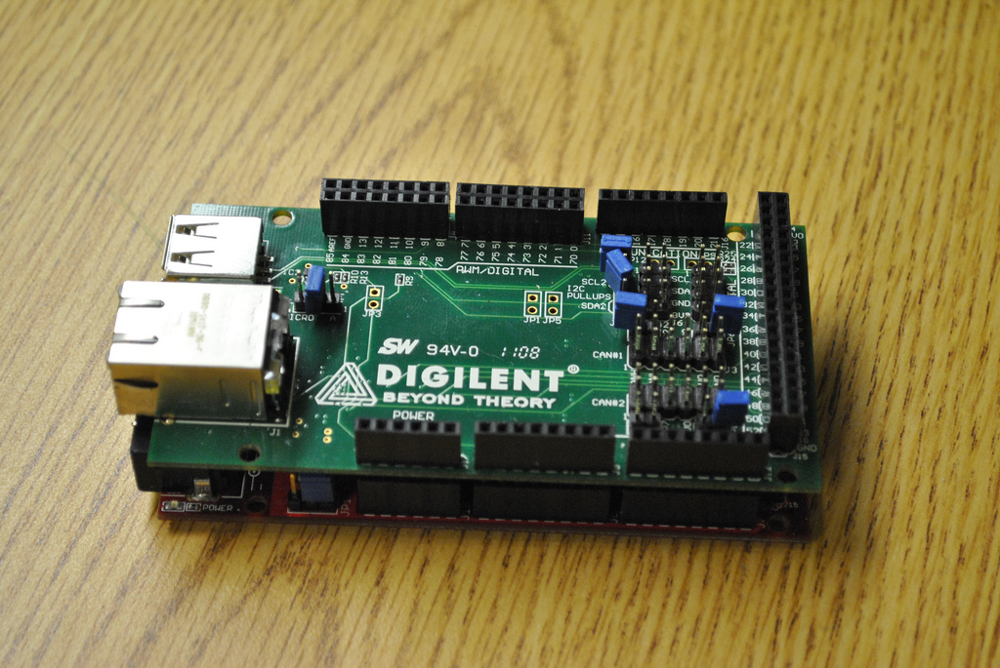
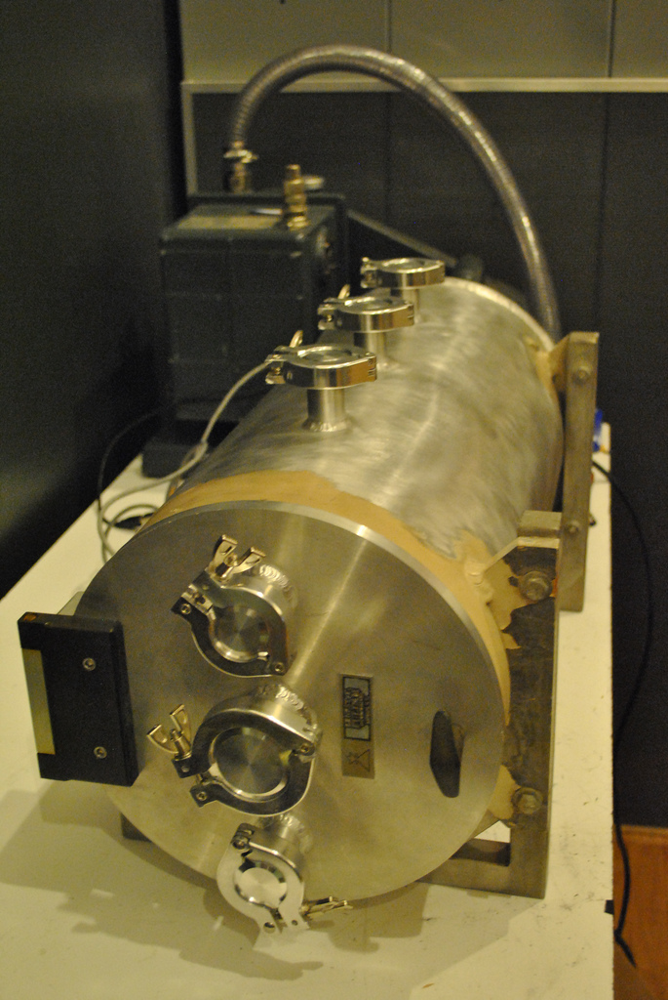
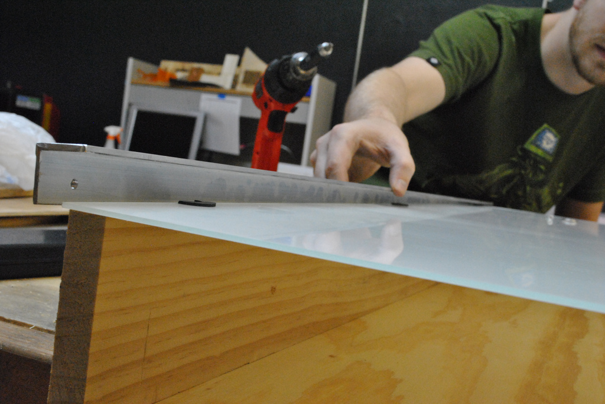
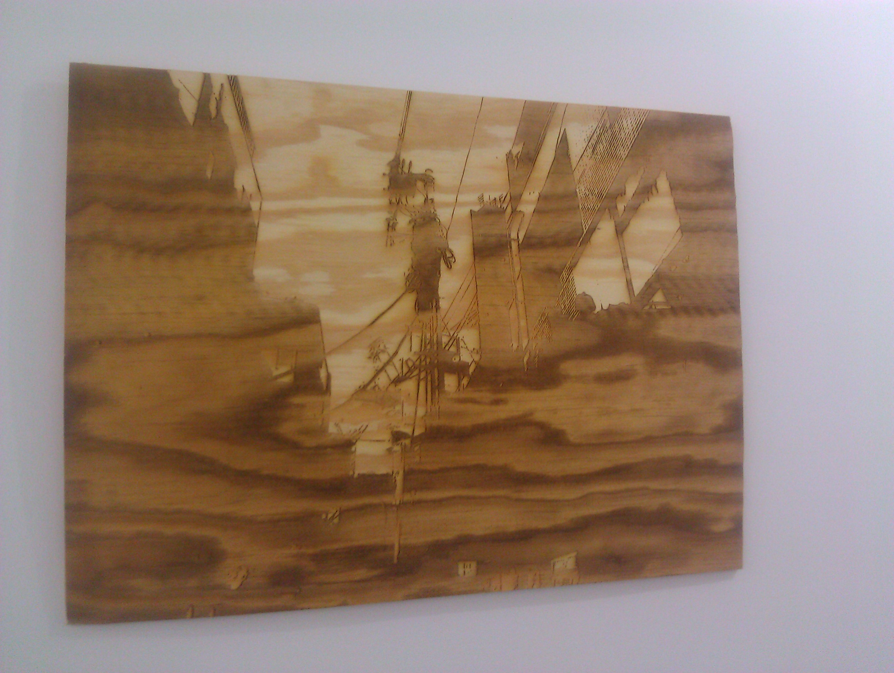

# Last Week in Pics Because it Happened

**Post** · 2011-08-30 · by `rrix` · `wp_posts.ID=2001`

---

**Gallery — thisweekinpics-29aug2011**

[!\[384297963\](../images/gallery/thisweekinpics-29aug2011/384297963.jpg)](../images/gallery/thisweekinpics-29aug2011/384297963.jpg)
*384297963*

[!\[6079101394\](../images/gallery/thisweekinpics-29aug2011/6079101394.jpg)](../images/gallery/thisweekinpics-29aug2011/6079101394.jpg)
*6079101394*

[!\[6081507243\](../images/gallery/thisweekinpics-29aug2011/6081507243.jpg)](../images/gallery/thisweekinpics-29aug2011/6081507243.jpg)
*6081507243*

[!\[6082033024\](../images/gallery/thisweekinpics-29aug2011/6082033024.jpg)](../images/gallery/thisweekinpics-29aug2011/6082033024.jpg)
*6082033024*

(Left to Right)

- Will does a wood etching that is far too large for our laser to properly handle. [Photo](http://twitpic.com/6csu7f) by Will Bradley.

- Will designed an LED whiteboard as well! [Photo](http://ow.ly/6kw8B) by HeatSync Labs

- The SEM vacuum chamber is back from K-Zell Metals with new air-tight welds! [Photo](http://ow.ly/6kw6m) by HeatSync Labs

- Folks from FUBAR labs, who developed the Chipkit software, stopped by to see the lab and show off new ChipKit shields. [Photo](http://ow.ly/6kw7l) by HeatSync Labs

---

### Attached media

---

[← archive index](../README.md)
