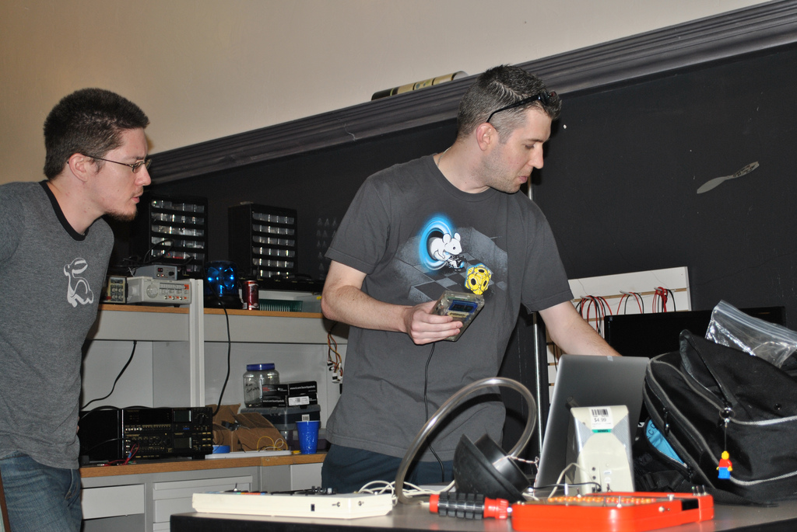
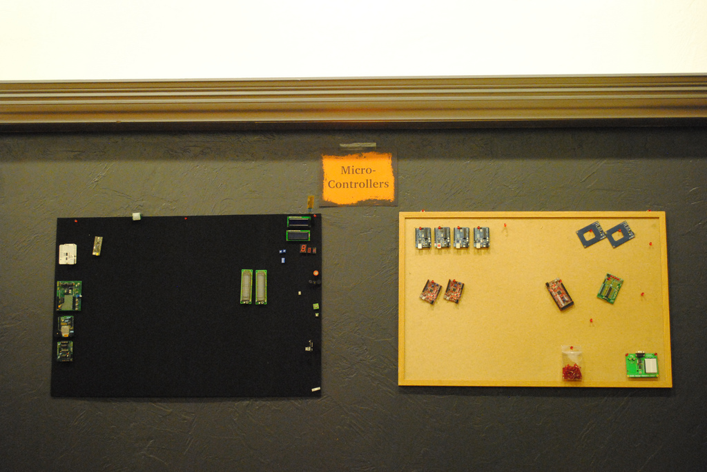
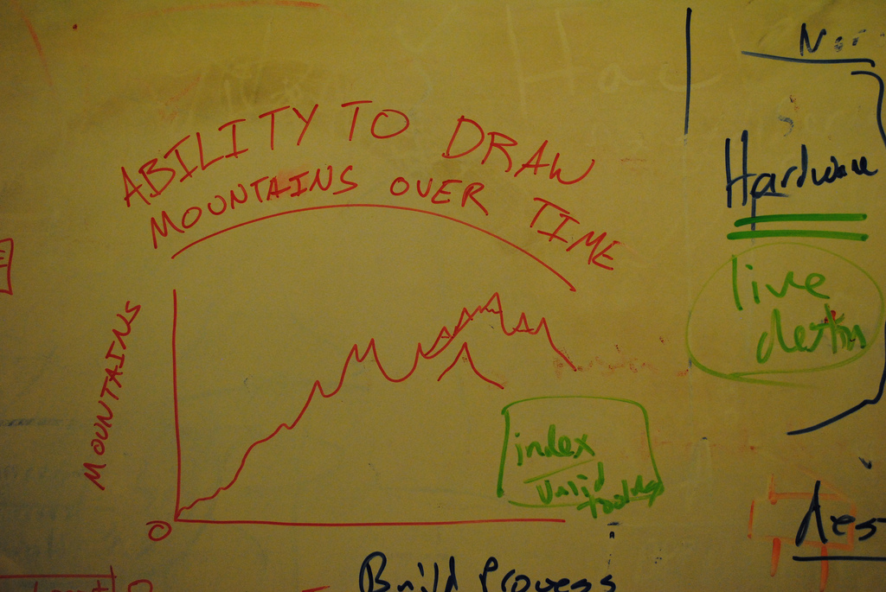
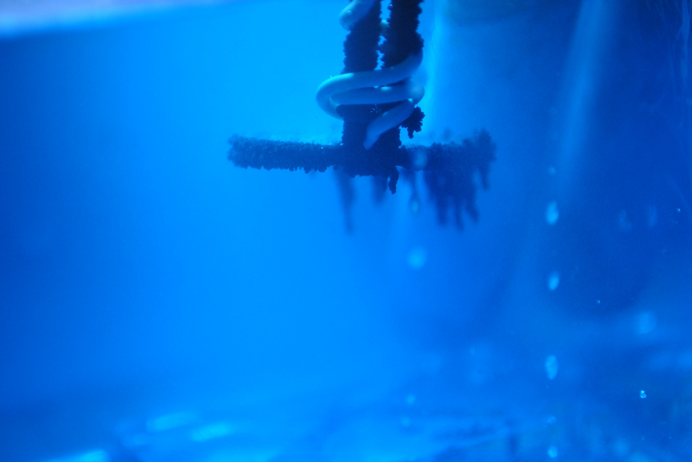

# This Week in Pics Because it Happened

**Post** · 2011-09-05 · by `rrix` · `wp_posts.ID=2047`

---

**Gallery — twip9-4-11**

[!\[6105156177\](../images/gallery/twip9-4-11/6105156177.jpg)](../images/gallery/twip9-4-11/6105156177.jpg)
*6105156177*

[!\[6107960371\](../images/gallery/twip9-4-11/6107960371.jpg)](../images/gallery/twip9-4-11/6107960371.jpg)
*6107960371*

[!\[6108515358\](../images/gallery/twip9-4-11/6108515358.jpg)](../images/gallery/twip9-4-11/6108515358.jpg)
*6108515358*

[!\[6109275850\](../images/gallery/twip9-4-11/6109275850.jpg)](../images/gallery/twip9-4-11/6109275850.jpg)
*6109275850*

(Left to Right)

- WidgetPhreak gives a live performance of 8bit piped straight out of Little Sound DJ on his Gameboy. [Photo](http://www.flickr.com/photos/60827818@N07/6105156177/in/photostream) by Ryan Rix

- A new microcontroller area appears at HeatSync Labs, and new signage appears to show off the areas of the lab. [Photo](http://www.flickr.com/photos/60827818@N07/6107960371/in/photostream) by HeatSync Labs

- The whiteboards are used, as always, for a bit of lighthearted fun. [Photo](http://www.flickr.com/photos/60827818@N07/6108515358/in/photostream) by HeatSync Labs

- Robert Bell recreates the universe. [Photo](http://www.flickr.com/photos/60827818@N07/6109275850/in/photostream) by HeatSync Labs.

---

### Attached media

---

[← archive index](../README.md)
