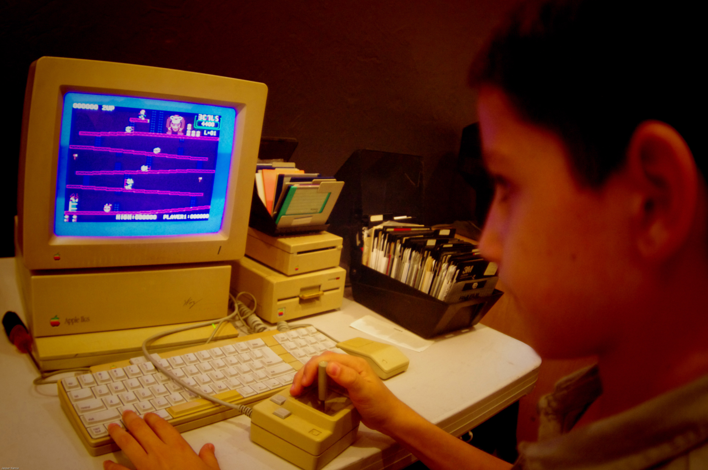
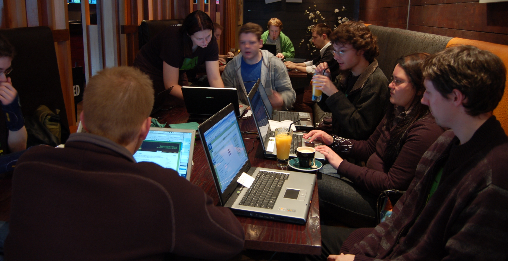

# A Smorgasbord of Code Hits the Lab

**Post** · 2011-09-06 · by `rrix` · 1 comments · `wp_posts.ID=2082`

---

[!\[Super Happy Dev House\](../images/uploads/2011/09/742923413_9b71b6d7b6_b.jpg)](http://www.flickr.com/photos/taniwha/742923413/in/pool-42289857@N00/)
*Photo by Br3nda. Distributed under a Attribution-NonCommercial-ShareAlike 2.0 Generic (CC BY-NC-SA 2.0) license.*

HeatSync Labs is hosting a handful of coding events! If you have a project you'd like to hack on, whether it's HTML5, Ruby or any of those old fashion native languages (of which your editor is a diehard), come by the space and hack on something awesome!

### Intro to HTML5 Game Development

This Saturday the 10th, join Luis as we dive in to game development in the browser! The presentation will cover the basics of building a browser based game using HTML5 and Javascript, and cover some tools and libraries that can help. The presentation will start at 7pm and afterwards there will be a general html5 hackfest.

### Foursquare API Hackfest

Then next Saturday, September 17th, at 10AM join Fletcher Fowler for the Foursquare API Hackfest here at HeatSync Labs. Be sure to [sign up](http://www.meetup.com/foursquare-API/Mesa-AZ/?a=socialmedia) and arrive early as we're buying donuts. From the site:

> The growing foursquare community (over 10 million!) is spread out all over the world and it's about time we had a hackathon that reflected our global nature. So, join us over the September 17-18th weekend for a round-the-clock hacking session that's happening all around the world!
> 
> In addition to our four official sites (NYC, San Francisco, Tokyo, & Paris) we welcome developers everywhere to band together and build amazing stuff on the foursquare API. There will be prizes, swag, and featured blog posts for the best hacks, no matter where in the world they come from.

---

### Attached media

---

[← archive index](../README.md)
