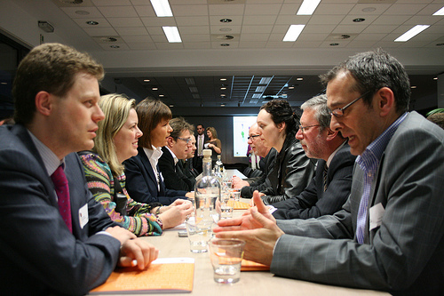

# Thursday (Oct 13): Hack Your Hackerspace and Board Meeting

**Post** · 2011-10-07 · by `rrix` · 1 comments · `wp_posts.ID=2184`

---

*It's meeting time! Photo licensed under CC-BY 2.0 by Voka Kamer van Koophandel Limburg*

This Thursday is our quarterly board meeting. The board will be discussing and voting on a number of topics and proposals outlined on this [schedule](http://groups.google.com/group/heatsynclabs/browse_thread/thread/59b8a7bf906058d6). All members in good standing are encouraged to attend the meeting and voice opinions on the topics that matter. We will be starting promptly at 7:00 PM in the common area downstairs.

Afterwards, we'll be holding our bi-monthly hackerspace hacking session! We'll have a [list of tasks](http://groups.google.com/group/heatsynclabs/msg/5665c429dc355cb0) to accomplish for Great Justice, as well as a chance for the membership to steer the direction our space is headed.

---

[← archive index](../README.md)
