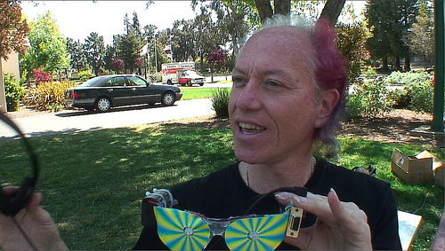
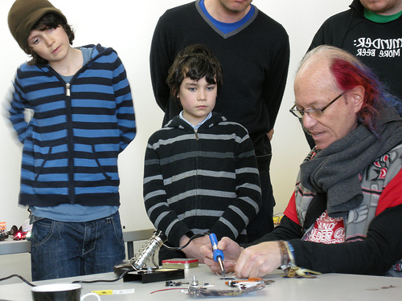

# Arduino for Total Newbies with Mitch Altman

**Post** · 2011-10-27 · by `rrix` · `wp_posts.ID=2226`

---

[!\[Mitch Altman and Jimmie Rodgers workshop with fizzPOP\](../images/uploads/2011/10/4417827308_4746c70265.jpg)](http://www.flickr.com/photos/nikki_pugh/4417827308/)Mitch gives his soldering workshop at fizzPOP. Photo by [Nikki Pugh](http://www.flickr.com/photos/nikki_pugh/)
Hey Arizona! Hackerspace luminary and co-founder of [Noisebridge](http://noisebridge.net) Mitch Altman will be in the Valley over Thanksgiving weekend. Mitch will be hosting his [world-famous](http://events.ccc.de/camp/2011/wiki/ArduinoForTotalNewbies_Day2) Arduino for Total Newbies workshop at HeatSync Labs! Learn everything it takes to go from newbie to owning a completed [TV-B-Gone](http://tvbgone.com). This mythical device has the magical ability to turn off all the TVs within range, through the wonders of Infrared, and you can create one with the guidance of Mitch.

The workshop will cover soldering your board, introductory Arduino programming using the [BoArduino platform](http://www.ladyada.net/make/boarduino/) and finally modifying it in to a TV-B-Gone. Space is limited to 30 people for this workshop. This is a great stepping stone for anyone who wants to get involved with Arduino or microelectronics and who doesn't know where to dive in, so be sure to sign up ASAP!

> Arduino For Total Newbies workshop
> Saturday 26-Nov, from 1:00pm to 4:00pm.

[Offsite image — hosted on guestlistapp.com](#)

---

### Attached media

---

[← archive index](../README.md)
