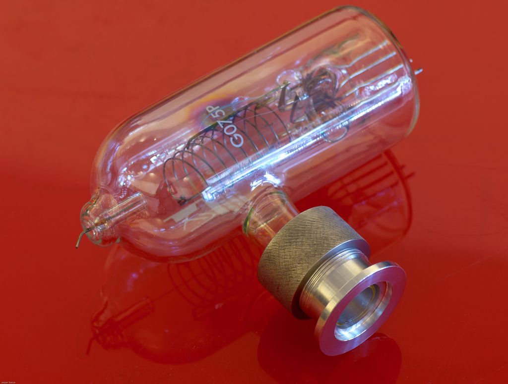
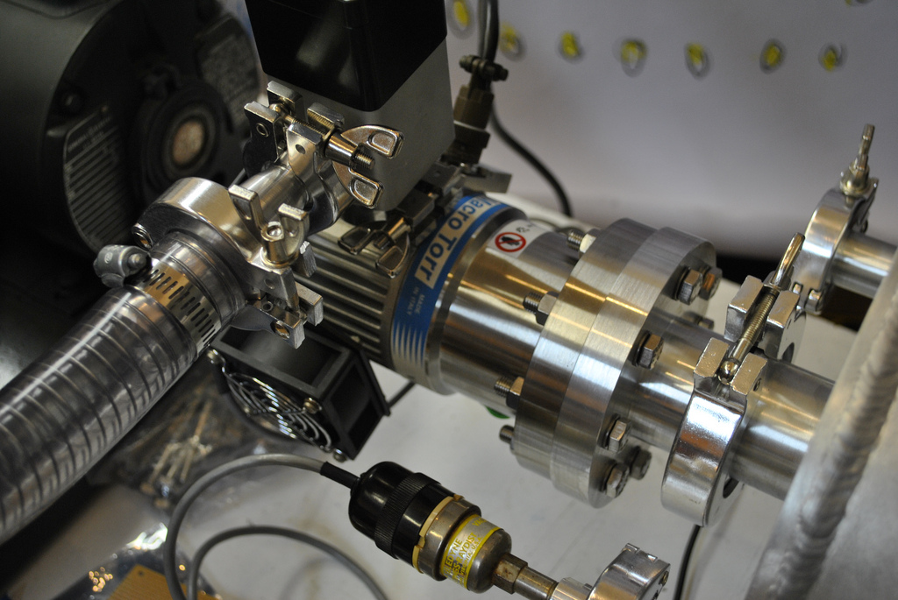

# SEM Build Blog Updates

**Post** · 2011-12-27 · by `rrix` · `wp_posts.ID=2432`

---

Jasper is back in action on the [SEM project](http://wiki.heatsynclabs.org/wiki/SEM_Microscopy)! She's recently posted two updates on the SEM buildblog:

***[Compression Fitting Assembled with BA Gauge](http://hsl-sem.tumblr.com/post/14701732133)***

[!\[\](../images/uploads/2011/12/6559592381_2c6e5414ab_b-300x227.jpg)](http://www.flickr.com/photos/nebarnix/6559592381/)
*Compression Fitting Assembled with BA Gauge by Jasper Nance*

> The BA gauge which I want to use to measure the ultimate vacuum level is a glass tube type and lacks a flange. The solution is either to torch a metal fitting out of kovar (expensive) or to use a simple viton O-ring compression fitting. Since the latter isn’t destructive and I don’t yet trust my glassblowing skills, I went with the compression fitting.
> 
> Instead of buying a compression fitting from a vacuum supplier, I decided to go ahead and turn one on the lathe for practice. The combination of threading, tight tolerances, dissimilar materials and knurling made this the most advanced lathe project I have yet taken on.

***[Turbomolecular Porn](http://hsl-sem.tumblr.com/post/14710385864)***

[!\[\](../images/uploads/2011/12/6180407883_3d34921036_b-300x200.jpg)](http://www.flickr.com/photos/hslphotosync/6180407883/)
*Turbomolecular Porn by Jasper Nance*

> The turbomolecular pump has been attached! The largest flange on the chamber is a KF-50 for various reasons including cost of fitting hardware. Above this size, ISO fittings must be used and these are much more expensive than the KF style.

Head on over to the [HSL SEM buildblog](http://hsl-sem.tumblr.com/) and check it out!

---

### Attached media

---

[← archive index](../README.md)
