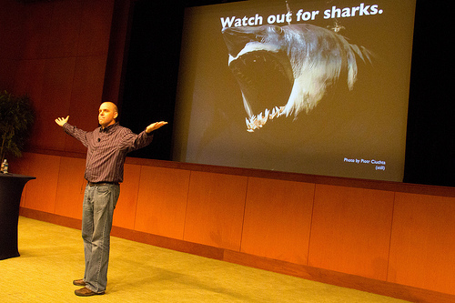

# Fri (Jan 13): Hot Topics!

**Post** · 2012-01-08 · by `rrix` · 1 comments · `wp_posts.ID=2476`

---

*Beware of Sharks!  Photo by Betsy Weber*

This Friday, HeatSync Labs will be hosting the latest in our series of unfortunately titled lightning talk nights, Hot Topics! Much like Ignite, TED and Noisebridge's Five Minutes of Fame, these talks give the community the chance to show off all of the awesome things they are working on. We've an exciting lineup this time around:

- Ryan Rix - Introductions to Hot Topics

- Jasper Nance - Easy Peasy Anodeezy

- Prescott Ogden - Five Most Important Skeinforge Settings

- Jim St. Leger - Driving Electric: First hand impressions of living with an electric car

- Hunter and Tanner Schineller - Introduction to Glass Fusion

- Ryan Rix - Hackerspace Management

- Will Bradley - RFID Interlocks

- Michael Christianson - Rebelhold

Hot Topics will be this Friday starting at 7:00 PM sharp. Bring a friend, and bring something awesome to work on afterwards!

All HeatSync Labs meetings are open to the public and free. If you really want to give us money, though, we will be accepting donations and selling tee shirts, Arduinos and more!

HeatSync Labs is located east of Robson on Main Street at:
[140 W Main St.
Mesa, AZ 85201](http://maps.google.com/maps?f=q&source=s_q&hl=en&geocode=&q=140+w+main+st.+mesa,+az&aq=&sll=37.0625,-95.677068&sspn=34.945679,76.464844&ie=UTF8&hq=&hnear=140+W+Main+St,+Mesa,+Arizona+85201&ll=33.415289,-111.835499&spn=0.000795,0.001167&t=h&z=20)

---

[← archive index](../README.md)
