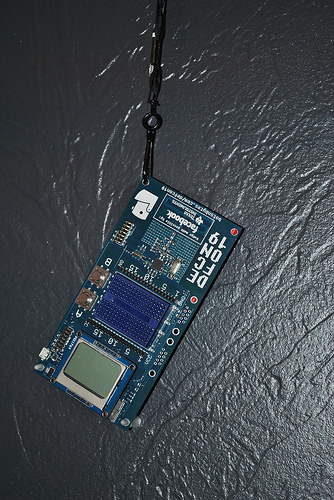

# Wed (Feb 1): Arduino Night

**Post** · 2012-01-30 · by `rrix` · `wp_posts.ID=2550`

---

*The DEFCON 19 Electronics Badge, photo by Ryan Rix*

This Wednesday is Arduino hacknight at HeatSync Labs!

Arduino night is our monthly basic electronics and microcontrollers meetup night! All skill levels and ages are welcome. Whether you even know what a microcontroller is or if you lay out your own boards, stop by! And we by no means limit the microcontroller to Atmel parts-- Microchip, TI, Motorola we don't care bring it!
This month: We're taking a look at the past few years Defcon hardware badges! These are the prized possessions each year at Defcon. We've got a few years worth, and if you've got an old one dig it out of the closet! If you've never gotten to interact with one, stop by well be tearing them apart from hardware to firmware and seeing what makes them tick.

---

[← archive index](../README.md)
