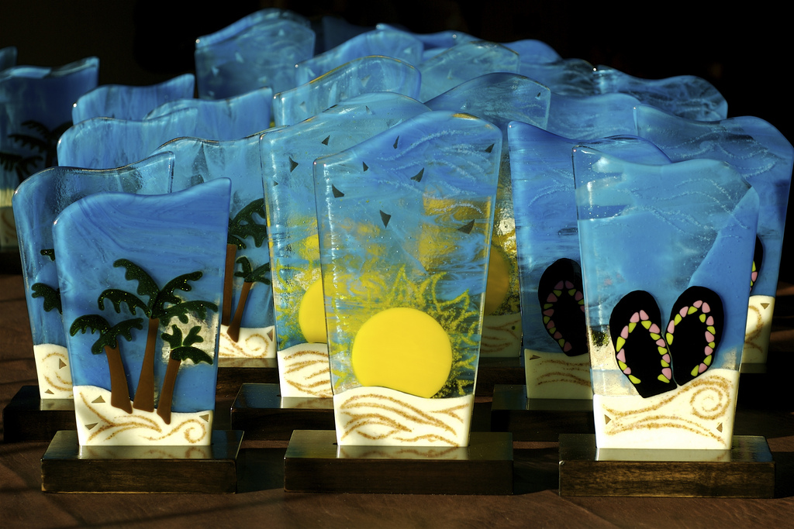
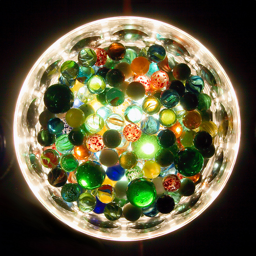

# Sun (Feb 26): Glass Fusion Workshop

**Post** · 2012-02-06 · by `rrix` · 2 comments · `wp_posts.ID=2552`

---

*Fused Glass Photos, photo by John Groseclose, All Rights Reserved*

HeatSync Labs has another class coming up! This time around, Holly Schineller will be giving an introduction to warm glass fusion.

What is Warm Glass?

Warm or Fused Glass are general terms that loosely cover most actions involving glass and a kiln. These include:

- Fusing (two or more pieces of glass heated to about 1480 degrees F until they melt together to become one)

- Slumping (using a mold in the kiln to change the shapre of a piece of glass)

- Casting (melting many small pieces of glass into one larger shape)

In this 2 hour+ workshop you will learn a brief history of fusing, the basic rules of fusing (like what glass wants to do, can and cannot do) and how to put together glass to recreate what you have in your mind.

You will get the chance to cut your own glass if you wish. The work will be fired off site. This is a simple workshop to let you experiment with some different types of glass and see how they fire up. If you plan on taking the next level class then use this as an opportunity to create test tiles for your more advanced (and expensive) piece. The next level class will be offered at Holly’s home studio to have easier access to the kiln.

2 weeks after the class (likely sooner but we’re just being safe here) you can pick up your finished 3.25 square slumped dish and other small items you made during class such as magnets or pendants.

**To attend you must sign up at our guest list link: [http://guestli.st/85836](http://guestli.st/85836)**

### Instructor

Holly Schineller attended both the California College of Art and ASU to complete her degree in Studio Art. Her commercial work has been focused on Glass Fusing for the last four years. Her work for pleasure includes drawing, painting, and occasionally street painting. You can see some of her commercial pieces on Facebook under Life With Art.

HeatSync Labs is located east of Robson on Main Street at:
[140 W Main St.
Mesa, AZ 85201](http://maps.google.com/maps?f=q&source=s_q&hl=en&geocode=&q=140+w+main+st.+mesa,+az&aq=&sll=37.0625,-95.677068&sspn=34.945679,76.464844&ie=UTF8&hq=&hnear=140+W+Main+St,+Mesa,+Arizona+85201&ll=33.415289,-111.835499&spn=0.000795,0.001167&t=h&z=20)

---

### Attached media

---

[← archive index](../README.md)
