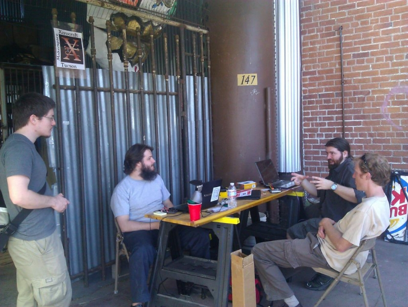

# Fri (Mar 9): Hot Topics Hits HeatSync Labs

**Post** · 2012-03-08 · by `rrix` · 2 comments · `wp_posts.ID=2604`

---

*Come hear about our budding neighbors and more this Friday! Photo by Will Bradley*

This Friday is second Friday! You know what that means, it's time for our unfortunately named Hot Topics speaker series! Come see what projects people in the lab are working on and find something awesome to work on yourself!

Our roster so far is:

- **Chad Stearns**: [Electronic Music Box](http://www.youtube.com/watch?v=tYtLUaChbEA)

- **Will Bradley**: [LED Matrix Kit](http://www.youtube.com/watch?v=EWG1LBRvW1I)

- **Jeremy Leung**: [Xerocraft Shenanigans](http://www.youtube.com/watch?v=6kruqEJ4BQM&feature=uploademail)

- A mystery prerecorded video that is tech related. Oooooh!

- And **you?**

If you want to present on friday drop us a mail on this [google groups thread](http://groups.google.com/group/heatsynclabs/browse_thread/thread/8d12a2bbb7b0c54c) and we'll hook you up. We won't be able to market for you beforehand, but we can get footage and get your video on the Tubes of You.

Along with the talks tomorrow we also have the Mesa Festival of Creativity having its opening night. This even thas pieces from some of our very own members and shares a lot of the same maker spirit found at the Lab.

All HeatSync Labs meetings are open to the public for **free**; Cover charges are for Scottsdale night clubs! If you really want to give us money though, t-shirts, membership and sponsorship subscriptions will be available and hustled aggressively by our volunteers.

HeatSync Labs is located east of Robson on Main Street at:
[140 W Main St.
Mesa, AZ 85201](http://maps.google.com/maps?f=q&source=s_q&hl=en&geocode=&q=140+w+main+st.+mesa,+az&aq=&sll=37.0625,-95.677068&sspn=34.945679,76.464844&ie=UTF8&hq=&hnear=140+W+Main+St,+Mesa,+Arizona+85201&ll=33.415289,-111.835499&spn=0.000795,0.001167&t=h&z=20)

---

[← archive index](../README.md)
