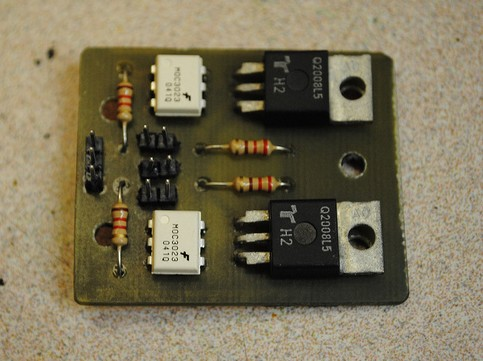

# Project! Switching EL Wire

**Post** · 2012-04-29 · by `rrix` · `wp_posts.ID=2619`

---

*Nate's custom printed EL Wire driver. Photo by Nate Plamondon, all rights reserved*

[Nate Plamondon](http://twitter.com/meznak) has been working on adding EL wire underlighting to his turn singals! He printed his own board which is used to switch the high voltage triacs needed to drive electroluminescent wires. He has a great writeup on the entire process over at [his blag](http://blag.meznak.net/2012/04/26/switching-el-wire/)!

> Once I had the board(s) laid out, it was time to actually make the thing. At [HeatSync Labs](http://heatsynclabs.org/), we have a few methods available for creating PCBs. My favorite so far is using the laser cutter. Unfortunately, the laser is unable to cut or etch copper, so we use black spray paint as a mask.
> 
> First, the copper is covered with a layer of black spray paint. Once dry, it’s placed on the laser cutter’s bed, and the design file is imported to the control software. Since the software isn’t very well-written, importing requires several file conversions.

---

[← archive index](../README.md)
