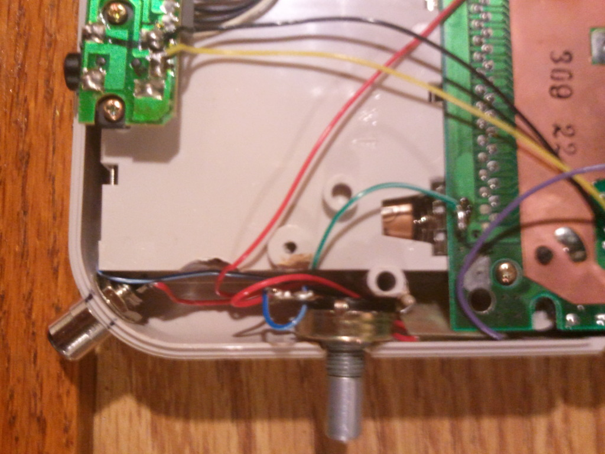

# Fri (May 11): Workshop - Build a Bottle-Cap Contact Mic

**Post** · 2012-04-30 · by `rrix` · `wp_posts.ID=2631`

---

[!\[\](../images/uploads/2012/04/2012-04-03174841-300x225.jpg)](http://s1266.photobucket.com/albums/jj524/CMKT4/?action=view&current=2012-04-03174841.jpg)
*The CMKT4 Team mods an original gameboy. Photo by CMKT4.*

On May 11th, HeatSync Labs will be hosting a workshop from the travelling circuit-bent band [CMKT4](http://getlofi.com) where you can learn to build your own piezo-electric pickup and listen to a live set as the your finished build dries.

> Join the members of the circuit-bent rock band CMKT4 for a workshop on building your very own EconoMIC Bottle Cap Contact Microphone (from Creme DeMentia). CMKT4 will show you how to solder up a piezo-electric pickup and house it sturdily in a recycled bottle-cap housing of their own design! Stick around for a set from the band as the tool-handle dip on your freshly built contact microphone dries. Additional take-home kits and other surprises will be available, come build a mic and see and hear some of the circuit-bent instruments you've read about on [www.GetLofi.com](http://www.GetLofi.com/) up close.
> 
> Bring your own instruments and objects to amplify!
> 
> Additional kits will be on sale for $10, and we'll have fully assembled mics in several varieties for sale as well. We'll have some other fun goodies also. Interested onlookers are encouraged to donate if they don't want to build a kit.

About the Instructors:

> CMKT 4 (from DeKalb, IL), the makers of Creme DeMentia Contact Microphones, have traveled the US teaching their workshops. In July of 2010, they attended the Detroit Maker Faire, which gave them a glimpse of the growing hackerspace movement. Shortly after, they had developed a kit for building their contact microphones in a workshop setting. They introduced their workshop at OmniCorpDetroit. Since then, CMKT 4 has taught workshops at 40 hackerspaces across the US, as well as several galleries and other venues. From Crash Space in LA, to As220 Labs in Providence, RI, the band has been canvasing the country in an effort to leave no hackerspace behind. CMKT 4 now offers a second workshop (Circuit Bending 101: Build a Bending Buddy), and has made return visits to several hackerspaces. The workshops are intended to provide a unique perspective on DIY electronics, while encouraging the creative use of recycled materials. Make sure not to miss CMKT 4 next time they come to your town!

Make sure you sign up ahead of time for the [workshop](http://guestlistapp.com/events/102522)! The workshop is 20$ and you leave the workshop with a complete and working bottle cap contact mic! And HeatSync Labs members can get 5 dollars off by using the code IMAMEBER when registering.

HeatSync Labs is located east of Robson on Main Street at:
[140 W Main St.
Mesa, AZ 85201](http://maps.google.com/maps?f=q&source=s_q&hl=en&geocode=&q=140+w+main+st.+mesa,+az&aq=&sll=37.0625,-95.677068&sspn=34.945679,76.464844&ie=UTF8&hq=&hnear=140+W+Main+St,+Mesa,+Arizona+85201&ll=33.415289,-111.835499&spn=0.000795,0.001167&t=h&z=20)

---

### Attached media

---

[← archive index](../README.md)
