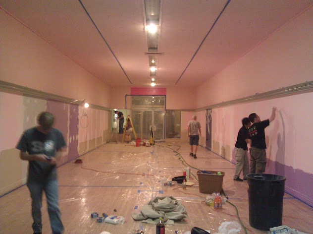
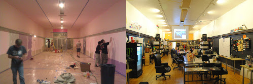

# Sat (Jun 9): Hotdoggin' at HeatSync Labs

**Post** · 2012-06-01 · by `rrix` · `wp_posts.ID=2741`

---

*It's only been a year since we've gone from pink party palace to hackery palace of awesome.*

This week we celebrate the first year of our lease at 140 w. Main Street, and what a year it has been. We have built robots, we have built rockets, we have built synthesizers, and that's only been this month! Our membership has increased three times over, we've done awesome things in the Mesa community, and it's time to celebrate. On Saturday June 9th, we'll be having a cookout and hangout at HeatSync Labs all afternoon and evening with music, foods and delicious celebrations of our delicious existence.

As an added bonus, Ryan Rix will be co-hosting a release party for the [Fedora Linux](http://fedoraproject.org) distribution's 17 release, codenamed [Beefy Miracle](http://beefymiracle.org). We'll be celebrating the a-bun-dant new features and shiny things to play with in the distro.

Frankly, it's going to be a great time, so don't be afraid to ketchup with us, Saturday, June 9th, 3pm-???!

HeatSync Labs is located east of Robson on Main Street at:
[140 W Main St.
Mesa, AZ 85201](http://maps.google.com/maps?f=q&source=s_q&hl=en&geocode=&q=140+w+main+st.+mesa,+az&aq=&sll=37.0625,-95.677068&sspn=34.945679,76.464844&ie=UTF8&hq=&hnear=140+W+Main+St,+Mesa,+Arizona+85201&ll=33.415289,-111.835499&spn=0.000795,0.001167&t=h&z=20)

---

### Attached media

---

[← archive index](../README.md)
