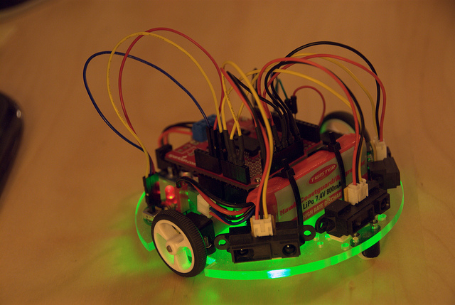

# Wed (Sept 5): Arduino Night + Hobby Robotics

**Post** · 2012-09-04 · by `jjrosent` · `wp_posts.ID=2946`

---

 Edge lit acrylic, for speed. Photo by joh.

**Arduino Night + Hobby Robotics (Wed Sept 5) 07:00 pm|az @ HeatSync Labs - Kipp Hall**

This week Arduino Night and Hobby Robotics team up! If you've been working on your line followers for Hobby Robotics bring them in any state they're in and lets get them running. If you've never built a robot before thats fine too, just bring yourself and a laptop. We'll supply sensors, Arduinos and the expertise to get you building.

HeatSync Labs is located east of Robson on Main Street at:
[140 W Main St.](http://maps.google.com/maps?f=q&source=s_q&hl=en&geocode=&q=140+w+main+st.+mesa,+az&aq=&sll=37.0625,-95.677068&sspn=34.945679,76.464844&ie=UTF8&hq=&hnear=140+W+Main+St,+Mesa,+Arizona+85201&ll=33.415289,-111.835499&spn=0.000795,0.001167&t=h&z=20)
[Mesa, AZ 85201](http://maps.google.com/maps?f=q&source=s_q&hl=en&geocode=&q=140+w+main+st.+mesa,+az&aq=&sll=37.0625,-95.677068&sspn=34.945679,76.464844&ie=UTF8&hq=&hnear=140+W+Main+St,+Mesa,+Arizona+85201&ll=33.415289,-111.835499&spn=0.000795,0.001167&t=h&z=20)

---

[← archive index](../README.md)
