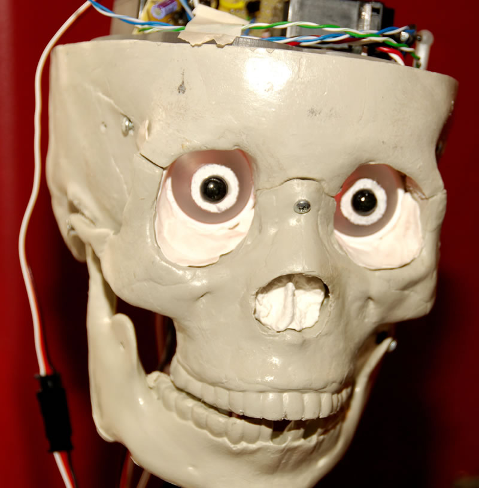

# Sun (Sept 16): AZ Haunters 3 Axis Skull Build

**Post** · 2012-09-08 · by `jjrosent` · `wp_posts.ID=2945`

---

 Choose your weapon. Photo by Jim.

**AZ Haunters 3 Axis Skull Build (Sun Sept 16) 11:00 am|az @ HeatSync Labs - Kipp Hall**

[AZ Haunters](http://azhaunters.ning.com/) is a group of Halloween enthusiasts in and around the Valley. Each month we meet to work on Halloween related projects or to share skills. One month might be electronic controls and pneumatics, the next may be paper mache - whatever the haunters are interested in.

September 2012 focuses on building a 3-axis skull. A 3-axis skull is a computer controlled skull that uses servos to move horizontally and vertically, and to open and close the jaw. When properly set up, the skull appears to talk or sing. This is a project requiring mechanical skill as well as coding. Bring your own skull kit ([one source](http://triaxialskulllabs.com/webstore/product_info.php?products_id=63)) if you want to walk away with a finished product, or just show up and see how they work.

HeatSync Labs is located east of Robson on Main Street at:
[140 W Main St.](http://maps.google.com/maps?f=q&source=s_q&hl=en&geocode=&q=140+w+main+st.+mesa,+az&aq=&sll=37.0625,-95.677068&sspn=34.945679,76.464844&ie=UTF8&hq=&hnear=140+W+Main+St,+Mesa,+Arizona+85201&ll=33.415289,-111.835499&spn=0.000795,0.001167&t=h&z=20)
[Mesa, AZ 85201](http://maps.google.com/maps?f=q&source=s_q&hl=en&geocode=&q=140+w+main+st.+mesa,+az&aq=&sll=37.0625,-95.677068&sspn=34.945679,76.464844&ie=UTF8&hq=&hnear=140+W+Main+St,+Mesa,+Arizona+85201&ll=33.415289,-111.835499&spn=0.000795,0.001167&t=h&z=20)

---

[← archive index](../README.md)
