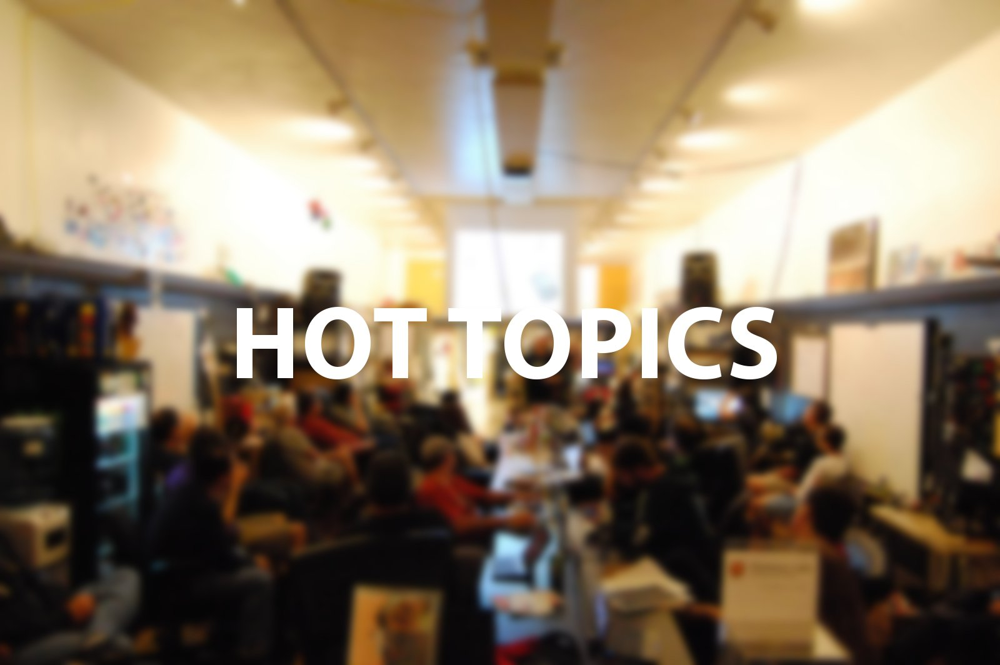

# Thursday (Jan 17): Hot Topics

**Post** · 2013-01-16 · by `blhack` · `wp_posts.ID=3096`

---

[!\[Hot Topics - Nov 15\](../images/uploads/2013/01/ht-1024x680.jpg)](http://www.heatsynclabs.org/thursday-jan-17-hot-topics/ht/) The last hot topics - November 15th

**Hot Topics (Thur Jan 17) 7:00 pm|az **@ HeatSync Labs - Kipp Hall

Hot Topics is our tragically named lightning talks series modeled on events like Ignite, Ted, and [Noisebridge's Five Minutes of Fame](http://www.noisebridge.net/wiki/Five_Minutes_of_Fame). Talks are ~5 minutes and generally revolve around creation and hackerspace culture.

Thursday's talks will include:

- [Jasper Nance](https://twitter.com/nebarnix) - "Microsecond Flash Photography Princicples: The Art of Destruction" (This is part of a talk that Jasper recently gave at the Exceptionally Hard and Soft meeting in Berlin)

- Corey Renner - Reverse-engineering the never-released Atari 1450XL 8-bit computer

- James Brooks - Parallels Between a Hackspace and Current Educational Trends

- [Chad Stearns](https://twitter.com/howmanycats) - Numbers

HeatSync Labs is located east of Robson on Main Street at:
[140 W Main St.
Mesa, AZ 85201](http://maps.google.com/maps?f=q&source=s_q&hl=en&geocode=&q=140+w+main+st.+mesa,+az&aq=&sll=37.0625,-95.677068&sspn=34.945679,76.464844&ie=UTF8&hq=&hnear=140+W+Main+St,+Mesa,+Arizona+85201&ll=33.415289,-111.835499&spn=0.000795,0.001167&t=h&z=20)

---

### Attached media

---

[← archive index](../README.md)
