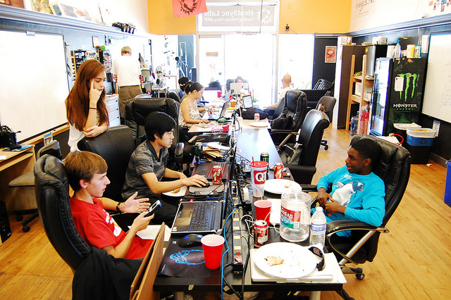

# The Weekly Sync 1

**Post** · 2013-10-23 · by `jjrosent` · `wp_posts.ID=3136`

---

*[!\[\](../images/uploads/2013/10/sync_logo2-300x300.png)](http://www.heatsynclabs.org/the-weekly-sync-1/sync_logo2/)Great things are happening at HeatSync and you should know about them. Welcome to The Weekly Sync where you sync up with what happened this week. **In this issue, calculus, arcade machines and goat meat!***

** **On Saturday and Sunday**, Hamilton High School students got a valuable lesson in
working smarter, not harder. Three weeks ago in calculus class, members of the Hamilton First Robotics Team 698, mentored by our own Tim M. and Austin K., were each assigned a mathematical function. Their mission was to graph it, rotate it around the X­ or Y-­axis and create a model of the resulting 3D shape.

Students in the calculus class not on the team were presumably left cutting out cross­section shapes by hand, while the members of the Hamilton team, and one of their very luck friends, headed straight for the laser cutter at the lab. (For anyone wondering, this shortcu... I mean, innovation, was approved by their professor.)
Here they are working on creating shapes in SolidWorks, which Austin and Tim then converted into laser files and cut out of cardboard.

[!\[\](../images/uploads/2013/10/10367547374_43c01836f0_z.jpg)](https://secure.flickr.com/photos/hslphotosync/10367547374/)

Some of the models were made of more than 50 pieces. Here's Toni's nearly finished shape derived from f(x) = ­2x^2+6x+1, g(x) = x+.2x^3 wrapped around the Y­axis. It's not glued together yet in this picture so she couldn't tip it, but it should be oriented sideways.

[!\[\](../images/uploads/2013/10/10372240376_0d83baa4b4_z.jpg)](https://secure.flickr.com/photos/hslphotosync/10372240376/)
Hours of work were reduced to minutes, about 30 on average, and a good thing too, because the projects are due today.

[!\[\](../images/uploads/2013/10/10372227035_8d511cc1a7_z.jpg)](https://secure.flickr.com/photos/hslphotosync/10372227035/)

##### BBQ / Lab get together ­ Meet your fellow members:

Also on Saturday, Moheeb's BBQ was a smashing success,

[!\[\](../images/uploads/2013/10/10369301104_a668966600_z.jpg)](https://secure.flickr.com/photos/hslphotosync/10369301104/) bringing together more than 35 members (including the Hamilton High School students)

for good food and plenty of hackery banter.

[!\[\](../images/uploads/2013/10/10369470883_6284d27e12_z.jpg)](https://secure.flickr.com/photos/hslphotosync/10369470883/)

[!\[\](../images/uploads/2013/10/10372383343_6ca391c530_z.jpg)](https://secure.flickr.com/photos/hslphotosync/10372383343/)

(If you didn't make it out, you missed some delicious goat.)

##### In the neighborhood:

[!\[\](../images/uploads/2013/10/10386507966_4f8dd47404_z.jpg)](https://secure.flickr.com/photos/hslphotosync/10386507966/)
If you've walked up Main toward Country Club lately, you may have already seen the beginnings of Power Pill, the arcade­related business moving in at 158. But what you may not know is that the owner, William U'Ren, actually used to hang out at HeatSync. (He even has a member profile.) While he was around, he was known for tinkering with and painting arcade game cabinets in the back.
[!\[\](../images/uploads/2013/10/10386512826_79a1562a6f_z.jpg)](https://secure.flickr.com/photos/hslphotosync/10386512826/)William said he got his first arcade game when he was 16 and became obsessed, but it wasn't until he was working at Antiques Plaza (just down the street in the other direction) that he started buying up games and repairing them in earnest. When he ran out of room in his apartment to store them, let alone work on restoration, he had to get creative. He convinced a few shops to give him space, leaving a game here and another game there. He also managed to beg key access from the owners so he could pick up the games at odd hours. But still without a place to work, he turned to guerrilla refurbishment. If you have ever ran across a guy painting or digging into the guts of a classic arcade game in a parking lot in the middle of the night, that was probably William. He said he was spending pretty much all of his spare time running out to different locations, picking up a cabinet and transporting it to a clandestine work location (and sometimes HeatSync). Eventually, he found a more permanent work space, but the respite was short­lived. The arrangement fell through and he had to move out.
Which brings us to August, when William found himself walking dejectedly down Main thinking that he made a good run of it, but that he might not be able to continue doing what he loved. Until he saw that 158 was for rent. He says he's just been going with the flow ever since and jokes that he was practically forced into opening up a the shop by how well everything fell into place. Word travels fast in the collector world and he said he's having trouble keeping enough games in the shop for when he actually opens his doors.
William said he prides himself on restoring games to factory specifications. While the games were in regular use, he explained, the operators who made a living off them usually took every possible repair shortcut. Downtime was lost revenue.Bringing games back to perfect condition takes time and care on a level that you don't really see anywhere outside of a truly passionate collector's workshop and that's his niche, he said.
His passion for arcade games isn't just obvious, it's infectious. He's currently working on restoring a PAC­MAN game for his personal collection, cleaning out soda gunk and replacing deteriorating plastic. The game has clearly been well loved, though William said it is in very good condition. It even has original art on the paneling. Walking around the cabinet, he points out a patch on the left panel where the paint has been worn away. PAC­MAN is a single joystick game he explained, and you can clearly see where players spent years resting their left hand while maneuvering the controls with their right.Though he is touching up the paint, that bit of history is staying right where it is. It gives it character, he said.
The obvious question, upon seeing these games in the store window at 158, is whether
or not they will be available to play. Sadly, it turns out that you have to have an entertainment license to run an arcade and it was infeasible for William to get one for Power Pill. But he is selling arcade games, so they will be turned on for demo purposes, he said. You can also pick up some cool pop­culture artifacts like toys and posters. Power Pill will be opening soon, though William doesn't have a specific date yet. In the meantime, The Weekly Sync wishes him luck on the final preparations before opening his doors and a hearty congratulations on turning his passion into his job.
**The next issue** of The Weekly Sync comes out Monday, Oct 28th. Until then, let me know what you're up to at alysonz@gmail.com.
_____________
*_Aly Z. has been a member of HeatSync Labs since August 2012 and has a physical impairment that prevents her from acknowledging grammar Nazis.*

---

### Attached media

---

[← archive index](../README.md)
